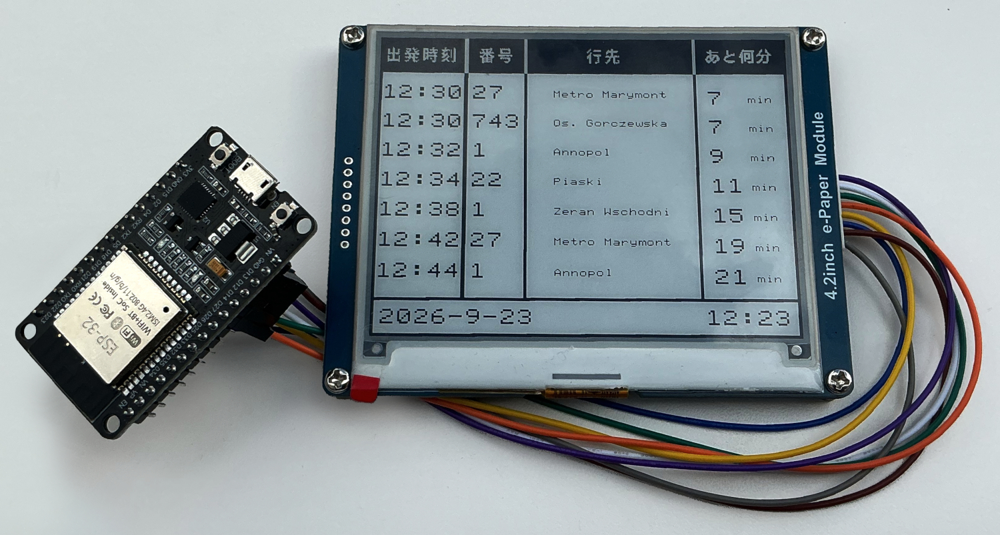

# Chronetic

An e-Ink public transport timetable. The software is composed of MicroPython code for ESP32 and a Rust service.
The service is written to parse data from the Warsaw's public transport API.

The device connects to the service and downloads a JSON file with 7 next departures counting from now with 3 minutes offset. Service fetches timetable data from API once a day or upon restart.



## Assembly and installation

### 1. Assembling the hardware

- Connect the components according to the pinout

##### Components

- E-paper E-Ink 4,2'' 400x300px SPI - Waveshare 13353
- ESP32 WiFi + BT 4.2 Development Board with ESP-WROOM-32 module

##### Pinout

```
                        ┌───────────────────────┐
                        │    ╔═════════════╗    │
                 EN   ──┤    ║             ║    ├──   D23 --- DIN       
                 VP   ──┤    ║ ┌────────┐  ║    ├──   D22                
                 VN   ──┤    ║ │ ESP-32 │  ║    ├──   TXO
                D34   ──┤    ║ │        │  ║    ├──   RXO
                D35   ──┤    ║ └────────┘  ║    ├──   D21
                D32   ──┤    ║             ║    ├──   D19
                D33   ──┤    ║             ║    ├──   D18  --- CLK       
                D25   ──┤    ║             ║    ├──   D5
                D26   ──┤    ║             ║    ├──   TX2              
   CS   ---     D27   ──┤    ║             ║    ├──   RX2               
   DC   ---     D14   ──┤    ║             ║    ├──   D4
   RST  ---     D12   ──┤    ║             ║    ├──   D2
   BUSY ---     D13   ──┤    ║    ┌───┐    ║    ├──   D15
   GND  ---     GND   ──┤    ║    │   │    ║    ├──   GND               
                 VN   ──┤    ║    └───┘    ║    ├──   3V3  --- VCC      
                        │    ╚═════USB═════╝    │
                        └───────────────────────┘

```

| e-Paper | Function | ESP32 GPIO |
|------------|----------|------------|
| BUSY | Busy state output | GPIO13 |
| RST | Reset signal input | GPIO12 |
| DC | Data/Command control | GPIO14 |
| CS | Chip select | GPIO27 |
| CLK | Serial clock input | GPIO18 |
| DIN | Serial data input | GPIO23 |
| GND | Ground | GND |
| VCC | Power supply (3.3V) | 3.3V |

### 2. Setting up the service (Warsaw's public transport API)

#### 2.1 Get the credentials

- API key

```
To obtain API key you need to register for free at https://api.um.warszawa.pl
```

- URL, List ID, Timetable ID

```
Available at https://api.um.warszawa.pl/ under:

dostępne dane -> transport miejski -> linie
dostępne dane -> transport miejski -> linie -> dokumentacja
dostępne dane -> transport miejski -> przystanki
dostępne dane -> transport miejski -> linie -> dokumentacja
```

- IP

```
Your subnet IP with a chosen port (eg. 192.168.1.0:7878)
```

- Wi-Fi SSID & password

```
Your network name and password
```

- Bus stop ID & number

```
Stops' IDs and numbers can be found at https://www.wtp.waw.pl
You can track one or more stops
```

#### 2.2 Fill the credentials

- Fill the variables in the following files:

```
chronetic/chronetic_service/.cargo/config.toml
chronetic/src/secrets.py
chronetic/chronetic_service/timetable_warsaw.rs (stops variable)
```

#### 2.3 Run the service

- If you do not have Rust installed follow the [instructions](https://rust-lang.org/tools/install/).
- Test the service

```
cd chronetic/chronetic_service
cargo test
```

- Run the service

```
cd chronetic/chronetic_service
cargo run --release
```

#### 2.4 Run the app as a service

- Configure a background service using systemd or else

### 3. Flash the device

#### 3.1 Connect the device

- Make sure device is visible, connected and flashed with MicroPython

#### 3.2 Flash it

- Run the bash script to flash the device and start the app:

```
cd chronetic
./deploy_esp32
```

## Disclaimer

Coded by a human - all bugs carefully crafted by hand.
